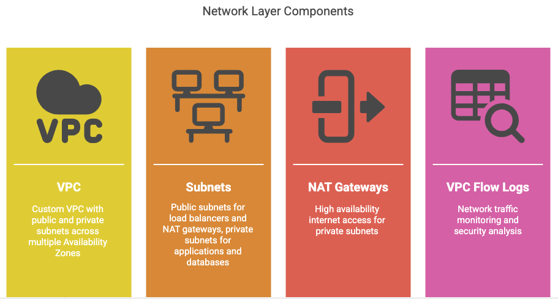
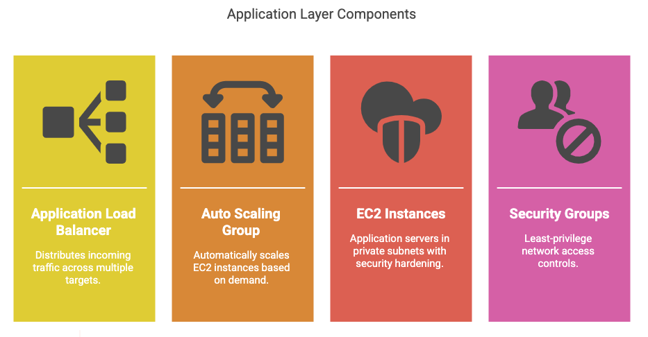
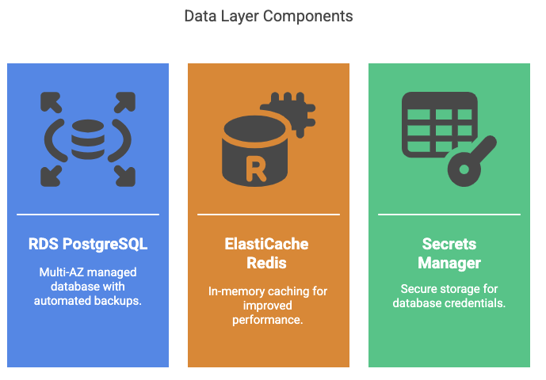
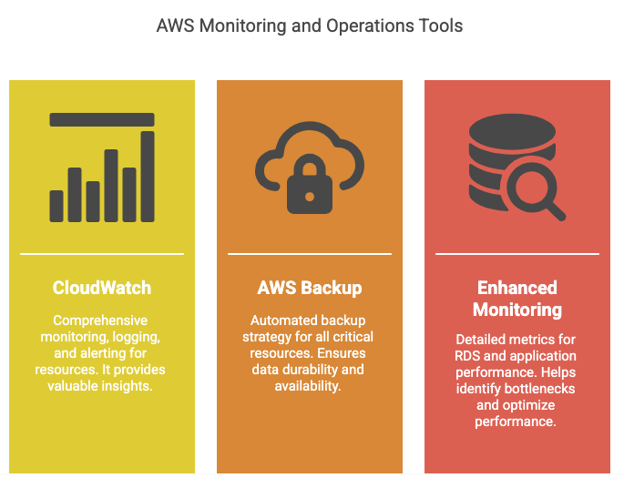
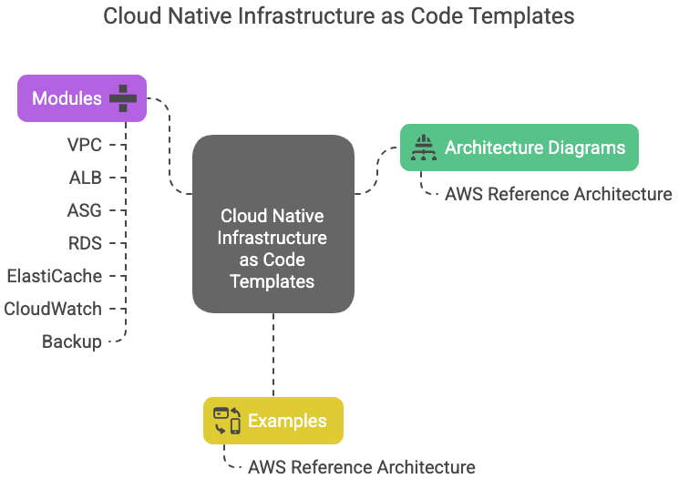
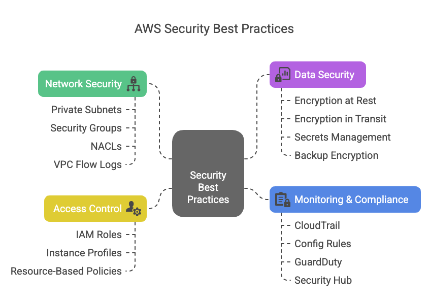

# Cloud Native Infrastructure as Code Templates

This repository contains production-ready Infrastructure as Code (IaC) templates for building scalable, secure, and highly available cloud-native applications on AWS using Terraform.

## 🏗️ Architecture Overview

The AWS reference architecture implements a 3-tier application with the following components:

### Network Layer
- **VPC**: Custom VPC with public and private subnets across multiple Availability Zones
- **Subnets**: Public subnets for load balancers and NAT gateways, private subnets for applications and databases
- **NAT Gateways**: High availability internet access for private subnets
- **VPC Flow Logs**: Network traffic monitoring and security analysis
  


### Application Layer
- **Application Load Balancer (ALB)**: Distributes incoming traffic across multiple targets
- **Auto Scaling Group (ASG)**: Automatically scales EC2 instances based on demand
- **EC2 Instances**: Application servers in private subnets with security hardening
- **Security Groups**: Least-privilege network access controls
  



### Data Layer
- **RDS PostgreSQL**: Multi-AZ managed database with automated backups
- **ElastiCache Redis**: In-memory caching for improved performance
- **Secrets Manager**: Secure storage for database credentials
  


### Monitoring & Operations
- **CloudWatch**: Comprehensive monitoring, logging, and alerting
- **AWS Backup**: Automated backup strategy for all critical resources
- **Enhanced Monitoring**: Detailed metrics for RDS and application performance
  



## 📁 Repository Structure

```
cloud-native-iac-templates/
├── README.md                           # This file
├── architecture-diagrams/              # Architecture diagrams and documentation
│   └── aws-reference-architecture.png
├── modules/                            # Reusable Terraform modules
│   ├── vpc/                           # VPC and networking
│   │   ├── main.tf
│   │   ├── variables.tf
│   │   └── outputs.tf
│   ├── alb/                           # Application Load Balancer
│   │   ├── main.tf
│   │   ├── variables.tf
│   │   └── outputs.tf
│   ├── asg/                           # Auto Scaling Group
│   │   ├── main.tf
│   │   ├── variables.tf
│   │   └── outputs.tf
│   ├── rds/                           # RDS Database
│   │   ├── main.tf
│   │   ├── variables.tf
│   │   └── outputs.tf
│   ├── elasticache/                   # ElastiCache Redis
│   │   ├── main.tf
│   │   ├── variables.tf
│   │   └── outputs.tf
│   ├── cloudwatch/                    # Monitoring and alerting
│   │   ├── main.tf
│   │   ├── variables.tf
│   │   └── outputs.tf
│   └── backup/                        # Backup configuration
│       ├── main.tf
│       ├── variables.tf
│       └── outputs.tf
├── examples/                          # Complete implementation examples
│   └── aws-reference-architecture/    # Full reference architecture
│       ├── main.tf                    # Main configuration
│       ├── variables.tf               # Input variables
│       ├── outputs.tf                 # Output values
│       ├── terraform.tfvars.example   # Example variable values
│       ├── user_data.sh              # EC2 initialization script
│       └── README.md                  # Example-specific documentation
└── LICENSE                           # License file
```




## 🚀 Quick Start

### Prerequisites

1. **AWS CLI** configured with appropriate credentials
2. **Terraform** >= 1.0 installed
3. **AWS Account** with necessary permissions

### Basic Deployment

1. **Clone the repository**
   ```bash
   git clone <repository-url>
   cd cloud-native-iac-templates
   ```

2. **Navigate to the example**
   ```bash
   cd examples/aws-reference-architecture
   ```

3. **Copy and customize variables**
   ```bash
   cp terraform.tfvars.example terraform.tfvars
   # Edit terraform.tfvars with your specific values
   ```

4. **Initialize and deploy**
   ```bash
   terraform init
   terraform plan
   terraform apply
   ```

### Example Configuration

```hcl
# terraform.tfvars
project_name = "myapp"
environment  = "prod"
aws_region   = "us-west-2"

# Network Configuration
vpc_cidr                = "10.0.0.0/16"
availability_zone_count = 3

# Application Configuration
instance_type        = "t3.medium"
asg_min_size        = 2
asg_max_size        = 10
asg_desired_capacity = 3

# Database Configuration
db_instance_class    = "db.t3.medium"
db_allocated_storage = 100
db_multi_az         = true

# Cache Configuration
redis_node_type = "cache.t3.micro"
redis_num_nodes = 2
```

## 🔧 Module Documentation

### VPC Module (`modules/vpc/`)

Creates a secure, multi-AZ VPC with public and private subnets.

**Key Features:**
- Configurable CIDR blocks and AZ count
- NAT Gateways for private subnet internet access
- VPC Flow Logs for security monitoring
- Route tables with proper routing

**Usage:**
```hcl
module "vpc" {
  source = "../../modules/vpc"
  
  name_prefix = "myapp-prod"
  vpc_cidr    = "10.0.0.0/16"
  az_count    = 3
  
  tags = {
    Environment = "production"
  }
}
```

### ALB Module (`modules/alb/`)

Application Load Balancer with health checks and SSL termination.

**Key Features:**
- HTTP/HTTPS listeners with SSL certificate support
- Health checks with configurable parameters
- Access logging to S3
- Security groups with minimal required access

### ASG Module (`modules/asg/`)

Auto Scaling Group with launch templates and scaling policies.

**Key Features:**
- Launch templates with encrypted EBS volumes
- IAM roles for SSM and CloudWatch access
- Auto scaling policies for scale up/down
- Integration with ALB target groups

### RDS Module (`modules/rds/`)

Managed PostgreSQL database with high availability and security.

**Key Features:**
- Multi-AZ deployment for high availability
- Automated backups with configurable retention
- Encrypted storage and secrets management
- Enhanced monitoring and performance insights

### ElastiCache Module (`modules/elasticache/`)

Redis cluster for application caching and session storage.

**Key Features:**
- Redis cluster mode or single-node configuration
- Subnet groups for multi-AZ deployment
- Security groups for controlled access
- Parameter groups for performance tuning

### CloudWatch Module (`modules/cloudwatch/`)

Comprehensive monitoring and alerting for all components.

**Key Features:**
- Custom dashboards for application metrics
- CloudWatch alarms with SNS notifications
- Log groups for application and system logs
- Auto scaling integration

### Backup Module (`modules/backup/`)

Automated backup strategy for all critical resources.

**Key Features:**
- AWS Backup plans with configurable schedules
- Cross-region backup replication
- Lifecycle policies for cost optimization
- Backup compliance reporting

## 🔒 Security Best Practices

### Network Security
- **Private Subnets**: Application and database tiers isolated from internet
- **Security Groups**: Least-privilege access with specific port/protocol rules
- **NACLs**: Additional network-level security controls
- **VPC Flow Logs**: Network traffic monitoring and analysis

### Data Security
- **Encryption at Rest**: All storage encrypted using AWS KMS
- **Encryption in Transit**: TLS/SSL for all data transmission
- **Secrets Management**: Database credentials stored in AWS Secrets Manager
- **Backup Encryption**: All backups encrypted with customer-managed keys

### Access Control
- **IAM Roles**: Service-specific roles with minimal required permissions
- **Instance Profiles**: EC2 instances use IAM roles instead of access keys
- **Resource-Based Policies**: Fine-grained access control for AWS services

### Monitoring & Compliance
- **CloudTrail**: API call logging for audit trails
- **Config Rules**: Compliance monitoring and remediation
- **GuardDuty**: Threat detection and security monitoring
- **Security Hub**: Centralized security findings management




## 📊 Monitoring & Alerting

### Key Metrics Monitored
- **Application**: Response time, error rates, throughput
- **Infrastructure**: CPU, memory, disk utilization
- **Database**: Connection count, query performance, replication lag
- **Network**: Latency, packet loss, bandwidth utilization

### Alert Thresholds
- High CPU utilization (>80% for 5 minutes)
- Database connection exhaustion (>80% of max connections)
- Application error rate (>5% for 2 minutes)
- Disk space utilization (>85%)

## 💰 Cost Optimization

### Resource Sizing
- **Right-sizing**: Use appropriate instance types for workload requirements
- **Reserved Instances**: Commit to 1-3 year terms for predictable workloads
- **Spot Instances**: Use for non-critical, fault-tolerant workloads

### Storage Optimization
- **EBS GP3**: Use GP3 volumes for better price/performance ratio
- **S3 Lifecycle**: Automatic transition to cheaper storage classes
- **Backup Retention**: Configure appropriate retention periods

### Monitoring Costs
- **Cost Explorer**: Regular cost analysis and trend monitoring
- **Budgets**: Set up alerts for unexpected cost increases
- **Resource Tagging**: Comprehensive tagging for cost allocation

## 🔄 CI/CD Integration

### Terraform Workflows
```yaml
# Example GitHub Actions workflow
name: Terraform Deploy
on:
  push:
    branches: [main]
    
jobs:
  terraform:
    runs-on: ubuntu-latest
    steps:
      - uses: actions/checkout@v3
      - uses: hashicorp/setup-terraform@v2
      - name: Terraform Init
        run: terraform init
      - name: Terraform Plan
        run: terraform plan
      - name: Terraform Apply
        run: terraform apply -auto-approve
```

### Environment Management
- **Workspaces**: Use Terraform workspaces for environment separation
- **Variable Files**: Environment-specific `.tfvars` files
- **State Management**: Remote state storage in S3 with DynamoDB locking

## 🆘 Troubleshooting

### Common Issues

**1. Terraform State Lock**
```bash
# Force unlock if needed (use with caution)
terraform force-unlock <lock-id>
```

**2. Resource Dependencies**
```bash
# View dependency graph
terraform graph | dot -Tpng > graph.png
```

**3. Debug Mode**
```bash
# Enable detailed logging
export TF_LOG=DEBUG
terraform apply
```

### Health Checks
- **ALB Health Checks**: Ensure application responds on health check path
- **RDS Connectivity**: Verify security group rules allow database access
- **Auto Scaling**: Check CloudWatch metrics for scaling decisions

## 🤝 Contributing

1. Fork the repository
2. Create a feature branch (`git checkout -b feature/amazing-feature`)
3. Commit your changes (`git commit -m 'Add amazing feature'`)
4. Push to the branch (`git push origin feature/amazing-feature`)
5. Open a Pull Request

### Development Guidelines
- Follow Terraform best practices and style guide
- Include comprehensive documentation for new modules
- Add examples demonstrating module usage
- Ensure all resources are properly tagged
- Test changes in a development environment

## 📄 License

This project is licensed under the MIT License - see the [LICENSE](LICENSE) file for details.

## 📞 Support

For questions, issues, or contributions:
- Create an issue in this repository
- Review existing documentation and examples
- Check AWS documentation for service-specific guidance

---

**Note**: This infrastructure template is designed for production use but should be customized based on your specific requirements, compliance needs, and organizational policies.
